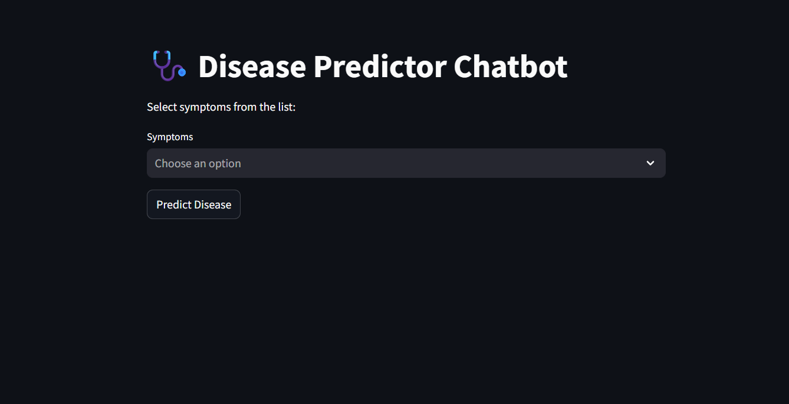
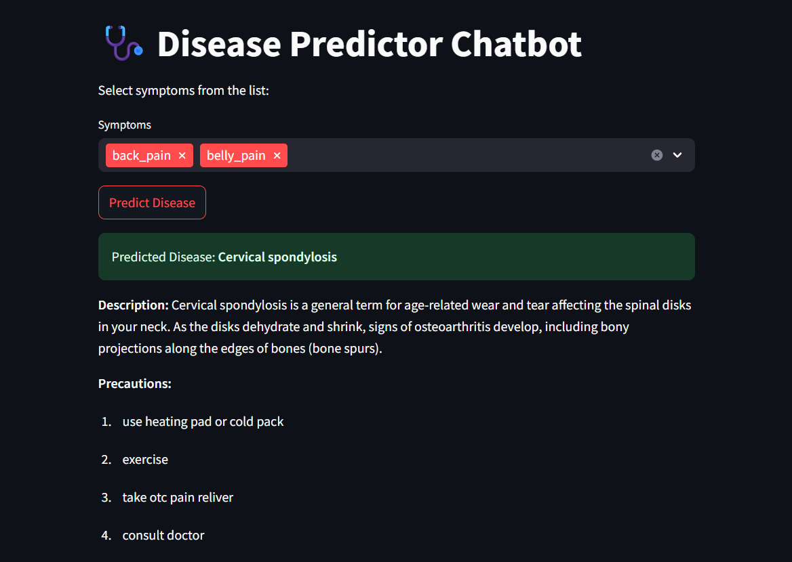

# 🩺 Disease Prediction Chatbot

This project is a machine learning-based disease prediction system designed to predict possible diseases based on user-selected symptoms. It also provides a detailed description and a list of precautions for the predicted disease.

It can be useful for health-related web applications, personal health trackers, or chatbot-based health assistants.

## 📚 Objective

The primary goal of this project is to:

✔️ Allow users to select multiple symptoms they are experiencing.  
✔️ Predict the most likely disease using a Machine Learning model.  
✔️ Provide a description of the disease.  
✔️ Display precautionary measures to prevent or handle the disease.  
✔️ Help users understand possible health issues based on their symptoms.


## 🔍 Features

- ✅ User-friendly Streamlit Web Interface
- ✅ Multi-symptom selection through dropdown
- ✅ Machine Learning powered disease prediction
- ✅ Precautionary measures display
- ✅ Validation to prevent prediction when no symptoms are selected
- ✅ Clear prediction output

## 📂 Project Structure
Disease_Predictor_Chatbot/
│
├── app.py # Streamlit Web App
├── model/
│ ├── disease_model.pkl # Trained ML Model
│ ├── symptom_encoder.pkl # Encoder for Symptoms and Diseases
│ └── disease_info.json # Disease Descriptions and Precautions
├── data/
│ ├── Symptom-severity.csv
│ ├── symptom_Description.csv
│ └── symptom_precaution.csv
├── images/
│ ├── interface.png
│ ├── no_input_warning.png
│ ├── prediction_output.png
│ └── symptoms_selection.png
├── requirements.txt # Required Python packages
├── .gitignore # Git ignored files/folders
└── README.md # Project documentation


## 🛠️ Technologies Used
- Python
- Streamlit
- Scikit-Learn
- Pandas
- NumPy
- Machine Learning (Classification)

## 📊 Dataset Information

- **training.csv**: Contains diseases and their associated symptoms used for training the model.
- **symptom_precaution.csv**: Maps diseases to corresponding precautions.
- **symptom_Description.csv**: Maps diseases to their descriptions.
- **Symptom-severity.csv**: Provides severity values for symptoms (optional use).

## 🌐 Streamlit Web Interface

To make the disease predictor user-friendly, a Streamlit-based web app has been created.

The app allows users to:

- ✅ Select symptoms from a multiselect box.
- ✅ Click the "Predict Disease" button.
- ✅ Instantly view:
  - Predicted disease name.
  - Disease description.
  - Recommended precautions.
- ✅ Receive warnings if no symptoms are selected.

## 🖼️ App Screenshots

### 1️⃣ Web Interface


### 2️⃣ Symptom Selection


### 3️⃣ Prediction Output


### 4️⃣ Warning for No Input


## 🚀 How to Run the Project

### Clone the Repository

```bash
git clone https://github.com/SejalM30/Disease_Predictor_Chatbot.git
cd Disease_Predictor_Chatbot


